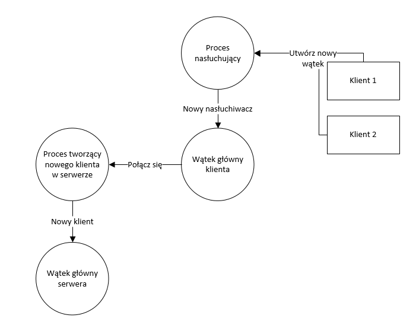
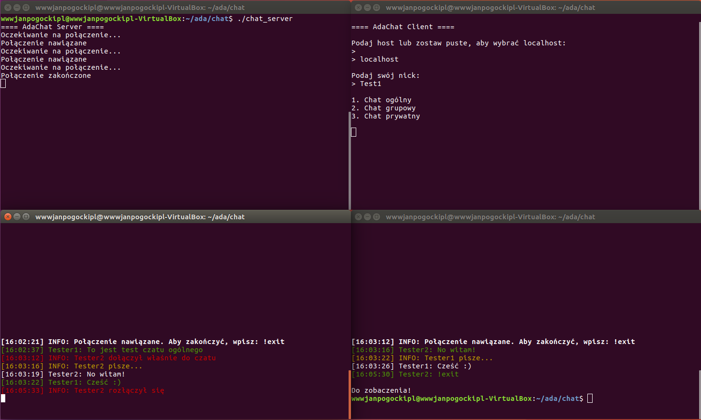
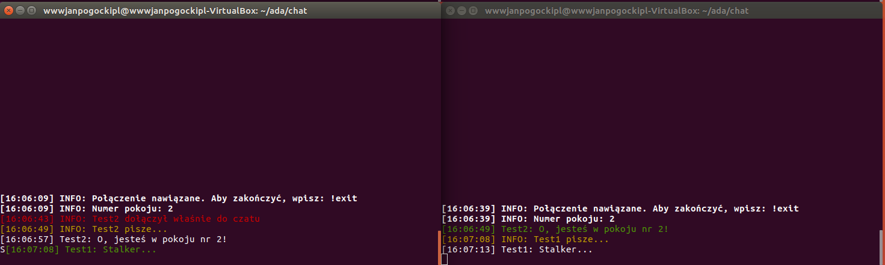

# AdaChat

## Autorzy

Jan Pogocki, Dawid Siedlarz, Informatyka, III rok, gr. 2

## Data oddania

19.01.2017

## Cel programu

Nasz projekt składa się z dwóch programów: serwera oraz klienta. Ich celem jest stworzenie odpowiedniego środowiska do prowadzenia konwersacji. Dostępne są 3 różne metody komunikacji:
- *czat ogólny* - czat prowadzony między wszystkimi połączonymi do serwera
- *czat grupowy* - jedna osoba tworzy nowy pokój do rozmów, otrzymuje jego identyfikator, po którym dowolna liczba pozostałych użytkowników może do niego dołączyć
- *czat prywatny* - jedna osoba (adwersarz nr 1) wpisuje nick osoby, z którą chce rozmawiać i czeka na jej połączenie; druga osoba (adwersarz nr 2) wpisuje nick adwersarza nr 1 i wówczas następuje połączenie obydwu osób, które mogą rozmawiać ze sobą

## Opis i schemat struktury logicznej programu

Komunikacja serwer-klient odbywa się w ramach socketów. Po uruchomieniu serwera, ten nasłuchuje na domyślnym dla AdaChat'u porcie (6000). Każde kolejne nowe połączenie z serwerem uruchamia na nim klienckiego taska - `Client_Task`. W ramach taska następuje wstępna konfiguracyjna komunikacja z klientem. To właśnie wtedy klient otrzymuje numer pokoju, zezwolenie na dołączenie do żądanego pokoju etc.

Działanie klienta polega przede wszystkim na zebraniu podstawowych informacji, które zostają wysłane po nawiązaniu kontaktu z serwerem. Późniejsze procedury zależą od odpowiedzi serwera, co kończy się wreszcie wejściem do przydzielonego lub żądanego pokoju. Wtedy uruchamiany jest współbieżny task `nasluchiwacz`, który zresztą jak sama nazwa wskazuje - nasłuchuje nowych wiadomości czatu z serwera, a następnie filtruje je.

## Diagram kooperacji UML

## Informacje o stosowanych pakietach zewnętrznych

Do projektu AdaChat została użyta biblioteka [AdaSockets](https://www.rfc1149.net/devel/adasockets.html).

## Informacje o zastosowaniu specyficznych metod rozwiązania problemu

Do prawidłowego działania programu klienckiego, potrzebne było napisanie funkcji rozdzielającej łańcuchy znaków: `splitString`.

## Instrukcja obsługi

Aby skompilować AdaChat, należy w pierwszej kolejności skompilować źródła AdaSockets. W tym celu należy uruchomieć skrypt `./configure --prefix=/sciezka/do/katalogu/adasockets`, a następnie wykonać kompilację, wywołując `make install`. Pliki z katalogu `src` należy skopiować do katalogu z plikami źródłowymi AdaChat. Źródła serwera i klienta można teraz skompilować przy użyciu `gnatmake`. Uruchomienie serwera i klienta odbywa się poprzez domyślne wywołanie w terminalu, bez dodatkowych paramterów.

Obsługa serwera nie wymaga dodakowych akcji, obsługa klienta jest intuicyjna.

## Przykłady

## Możliwe rozszerzenia programu

- Jednoczesne prowadzenie wielu konwersacji na wielu kanałach, w jednym terminalu (możliwość przełączania się pomiędzy nimi)

## Ograniczenia programu

